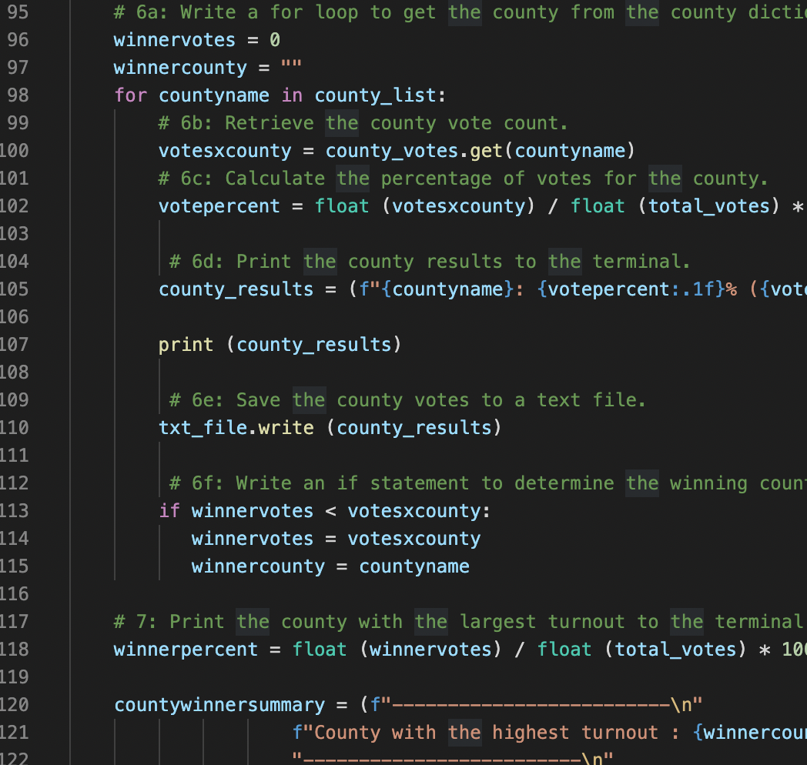
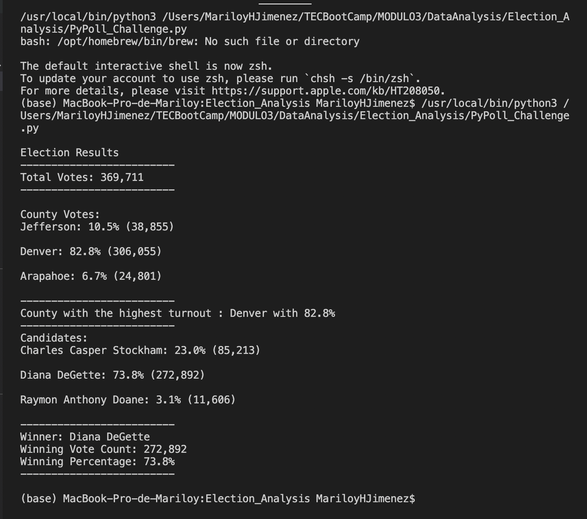
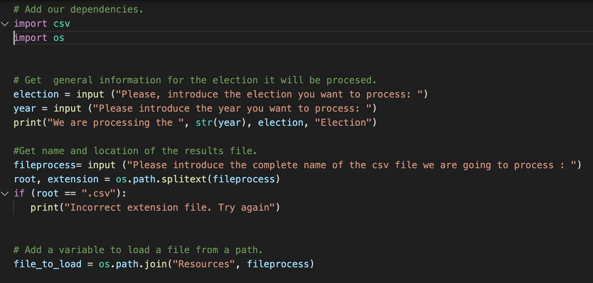

# Election Audit Analysis 
##  Overview
We were hired to support Colorado Boards of Elections in the election of the Congressional precint in Colorado. The results must be the total number of votes, the total number of votes for each candidate, the percentage of votes of each candidate and the winner of the electoosn. Also  must present additional data to complete the audit:
the voter turnout for each county, the percentage of votes from each county out of the total count, the county with the highest turnout.
The Client wants the Election results printed to the Comand Line and Saved to a Text File. 
## Election Audit Results  
  We will use Python instead excel or VBA because we will write algorithms to perform the analysis we had requested. We will begin reading the general list of votes, wich are stored in a cvs file in the format: ID Ballot, County, Candidate voted. This is an example of the final code: 
  

### Results of the Congressional Election in Colorado State.
 

1. How many votes were cast in this congressional election?   
   **As we can observe, this votation received a total 369,711 votes.**
     
2. Provide a breakdown of the number of votes and the percentage of total votes for each county in the precinct.
3. Which county had the largest  of votes?
   
   
   **Denver was the highest turnout county with 306,055 votes**
4. Provide a breakdown of the number of votes and the percentage of the total votes each candidate received.
   
  
5. Which candidate won the election, what was their vote count, and what was their percentage of the total votes?
     
    
   **The Winner of the election was candidate Diana DeGette with 272,892 votes, 73.8% from the total votes.**
    
## Election-Audit Summary: 
We can conclude that the program we made for this problem can also be used for any vote count regardless of the position, since it only requires that the votes be stored in the same way as in this problem. As the program does not specify the position that is being chosen, we could ask the user to specify at the beginning the relevant information of the election, for example the position  and the year of election, and also we can specify the name and the location of the counting results file, in order that we can process it. 
 
